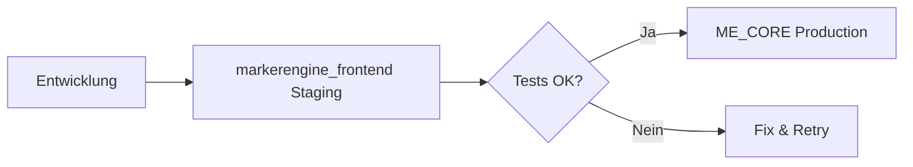

# Staging Strategy: Nutzung des bestehenden markerengine_frontend

## Überblick

Das bestehende `markerengine_frontend` auf Render wird als Staging/Test-Umgebung beibehalten, während `ME_CORE_Backend-mar-spar` die Hauptproduktionsumgebung wird.

## Vorteile dieser Strategie

1. **Isolierte Frontend-Tests**: Test neuer UI Features ohne Backend-Änderungen
2. **A/B Testing**: Vergleiche zwischen alter und neuer Implementierung
3. **Canary Deployments**: Schrittweise Rollouts neuer Features
4. **Performance Benchmarks**: Direkter Vergleich der Performance
5. **Fallback-Option**: Bei Problemen schneller Wechsel möglich

## Konfiguration

### 1. Bestehende markerengine_frontend umbenennen

In Render Dashboard:
```
Service Name: me-frontend-staging
URL: https://me-frontend-staging.onrender.com
```

### 2. Environment Variables anpassen

```env
# markerengine_frontend (Staging)
NEXT_PUBLIC_API_URL=https://me-core-backend.onrender.com/api
NEXT_PUBLIC_ENVIRONMENT=staging
NEXT_PUBLIC_FEATURE_FLAGS=experimental_features

# Optional: Eigene Staging API
# NEXT_PUBLIC_API_URL=https://me-core-backend-staging.onrender.com/api
```

### 3. Deployment Workflow



## Nutzungsszenarien

### 1. Feature Testing
```bash
# Deploy new feature to staging
git push staging feature/new-ui

# Test on markerengine_frontend
# If successful, merge to main for production
```

### 2. Performance Testing
- Staging: Neue Optimierungen testen
- Production: Stabile Version
- Vergleiche Metriken zwischen beiden

### 3. Canary Deployment
```javascript
// In markerengine_frontend
if (Math.random() < 0.1) { // 10% der User
  enableNewFeature();
}

// Monitor metrics
// If good, roll out to ME_CORE
```

### 4. A/B Testing
```javascript
// Route traffic based on user segment
const useNewUI = user.segment === 'beta';
```

## Migration Timeline

### Phase 1: Setup (Woche 1)
- [ ] Rename markerengine_frontend to staging
- [ ] Update environment variables
- [ ] Configure monitoring

### Phase 2: Testing (Woche 2-3)
- [ ] Deploy test features to staging
- [ ] Compare performance metrics
- [ ] Gather user feedback

### Phase 3: Optimization (Woche 4)
- [ ] Fine-tune based on staging results
- [ ] Prepare production deployment

### Phase 4: Optional Consolidation (Monat 2+)
- [ ] Evaluate if staging still needed
- [ ] Consider cost optimization
- [ ] Make final decision

## Kosten-Nutzen-Analyse

### Kosten
- Render Staging: ~$7/Monat
- Zusätzliche Wartung: Minimal

### Nutzen
- Sicheres Testing: Unbezahlbar
- Schnelle Rollbacks: Kritisch
- User Confidence: Hoch

## Empfehlung

**Behalte markerengine_frontend für mindestens 3 Monate** als Staging-Umgebung. Danach evaluieren basierend auf:
- Nutzungshäufigkeit
- Gefundene Bugs
- Performance-Unterschiede
- Team-Feedback

## Alternative: Sofortige Abschaltung

Falls du Kosten sparen willst:

```bash
# 1. Backup der Konfiguration
render services show markerengine_frontend > frontend-backup.json

# 2. Suspend Service (kann reaktiviert werden)
render services suspend markerengine_frontend

# 3. Nach 30 Tagen ohne Probleme: Delete
render services delete markerengine_frontend
```

## Monitoring Setup

### Staging Metrics Dashboard
```javascript
// dashboard/src/pages/staging-comparison.tsx
export function StagingComparison() {
  return (
    <div>
      <MetricComparison 
        production="me-core.onrender.com"
        staging="me-frontend-staging.onrender.com"
      />
    </div>
  );
}
```

### Alerts
- Performance-Regression in Staging
- Error-Rate Unterschiede
- User-Feedback Tracking