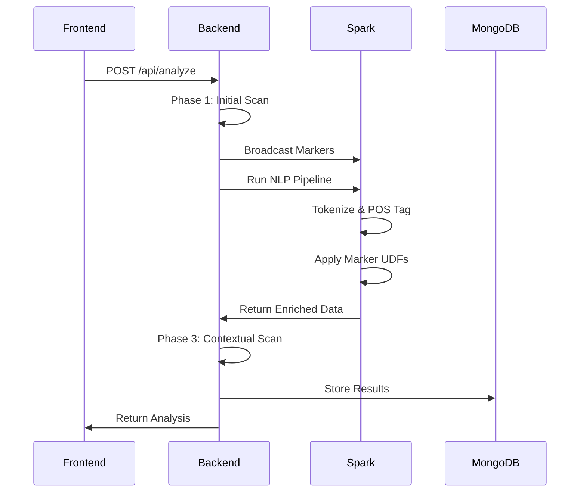

# ME_CORE Backend Architecture

## Übersicht

Das ME_CORE Backend-mar-spar Monorepo vereint drei Hauptkomponenten:

1. **Backend** - FastAPI-basierte REST API für Marker-Analyse
2. **Spark NLP** - Verteilte NLP-Verarbeitung mit Spark
3. **Frontend** - Next.js Web-Interface

## Systemarchitektur

```
┌─────────────────┐     ┌─────────────────┐     ┌─────────────────┐
│                 │     │                 │     │                 │
│    Frontend     │────▶│    Backend      │────▶│   Spark NLP     │
│   (Next.js)     │     │   (FastAPI)     │     │  (PySpark)      │
│                 │     │                 │     │                 │
└─────────────────┘     └─────────────────┘     └─────────────────┘
         │                       │                       │
         │                       ▼                       │
         │              ┌─────────────────┐             │
         │              │                 │             │
         └─────────────▶│    MongoDB      │◀────────────┘
                        │                 │
                        └─────────────────┘
                                 │
                                 ▼
                        ┌─────────────────┐
                        │                 │
                        │     Redis       │
                        │    (Cache)      │
                        │                 │
                        └─────────────────┘
```

## Datenfluss

### 1. Analyse-Pipeline



### 2. Schema Management

- **Single Source of Truth**: `backend/schemata/`
- **Auto-Sync**: TypeScript & Python Modelle via `tools/sync-schema-version.js`
- **Versionierung**: Semantic Versioning (v2.1, v2.2, etc.)

## Komponenten-Details

### Backend (`/backend`)

**Hauptmodule:**
- `api/` - REST Endpoints
- `detect/` - Marker-Detection-Engine
- `scoring/` - Score-Berechnung
- `markers/` - Marker-Definitionen
- `schemata/` - JSON-Schema Definitionen

**Technologien:**
- FastAPI für REST API
- Motor für async MongoDB
- Pydantic für Validation
- Prometheus für Metrics

### Spark NLP (`/spark-nlp`)

**Hauptkomponenten:**
- `src/udfs.py` - Spark User-Defined Functions
- `src/pipeline.py` - NLP-Verarbeitungspipeline
- `docker/` - Container-Definitionen

**UDFs:**
```python
detect_markers(text: String) -> Array[String]
score_markers(markers: Array[String]) -> Double
```

### Frontend (`/frontend`)

**Struktur:**
- Next.js 13+ mit App Router
- TypeScript für Type-Safety
- Tailwind CSS für Styling
- React Query für API-Calls

## Deployment

### Docker Compose Profile

```bash
# Basis-Services (ohne Spark)
docker-compose up

# Mit Spark NLP
docker-compose --profile spark up

# Mit Monitoring
docker-compose --profile monitoring up

# Production
docker-compose --profile production up
```

### Kubernetes

Helm Charts unter `k8s/` für:
- Horizontal Pod Autoscaling
- Ingress mit TLS
- ConfigMaps & Secrets
- PersistentVolumes

## Sicherheit

- **Authentication**: JWT-basiert (zukünftig)
- **Rate Limiting**: Per IP/API-Key
- **Input Validation**: Pydantic Models
- **CORS**: Konfigurierbar
- **TLS**: Nginx Reverse Proxy

## Performance

### Caching-Strategie

1. **L1 Cache**: In-Memory (Backend)
2. **L2 Cache**: Redis (Shared)
3. **TTL**: Konfigurierbar per Endpoint

### Optimierungen

- Spark Broadcast Variables für Marker
- MongoDB Indizes auf häufige Queries
- Connection Pooling
- Async I/O durchgängig

## Monitoring

### Metriken (Prometheus)

- Request-Latenz
- Marker-Detection-Rate
- Cache Hit/Miss Ratio
- System-Resources

### Health Checks

- `/api/health` - Comprehensive check
- `/api/health/live` - Kubernetes liveness
- `/api/health/ready` - Kubernetes readiness

## Entwicklung

### Branch-Strategie

- `main` - Production-ready
- `develop` - Integration branch
- `feature/*` - Feature branches
- `release/*` - Release candidates

### Testing

- **Unit Tests**: pytest, jest
- **Integration Tests**: docker-compose.test.yml
- **E2E Tests**: Cypress
- **Load Tests**: Locust

## Entscheidungen

### Warum Monorepo?

1. **Einheitliche Versionierung**: Alle Komponenten im Sync
2. **Gemeinsame CI/CD**: Ein Build-Prozess
3. **Code-Sharing**: Shared Types zwischen Frontend/Backend
4. **Atomic Changes**: Änderungen über Komponenten hinweg

### Warum FastAPI?

1. **Performance**: Einer der schnellsten Python-Frameworks
2. **Async Support**: Native async/await
3. **Auto-Dokumentation**: OpenAPI/Swagger built-in
4. **Type Safety**: Pydantic Integration

### Warum Spark für NLP?

1. **Skalierbarkeit**: Verteilte Verarbeitung
2. **German Models**: Spark NLP hat gute deutsche Modelle
3. **UDF Support**: Einfache Integration eigener Logik
4. **Broadcast Variables**: Effiziente Marker-Verteilung